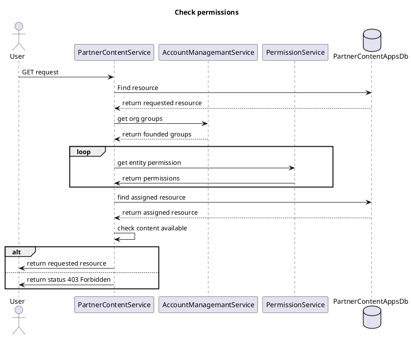

```plantuml
@startuml

title "Check permissions"
actor "User"
participant PartnerContentService
participant AccountManagemantService
participant PermissionService
database PartnerContentAppsDb

User -> PartnerContentService: GET request
PartnerContentService -> PartnerContentAppsDb: Find resource
PartnerContentAppsDb --> PartnerContentService: return requested resource
PartnerContentService -> AccountManagemantService: get org groups
AccountManagemantService --> PartnerContentService: return founded groups

loop
PartnerContentService -> PermissionService: get entity permission
PermissionService -> PartnerContentService: return permissions
end

PartnerContentService -> PartnerContentAppsDb: find assigned resource
PartnerContentAppsDb --> PartnerContentService: return assigned resource
PartnerContentService -> PartnerContentService: check content available

alt
PartnerContentService -> User: return requested resource
else
PartnerContentService -> User: return status 403 Forbidden
end
@enduml
```
